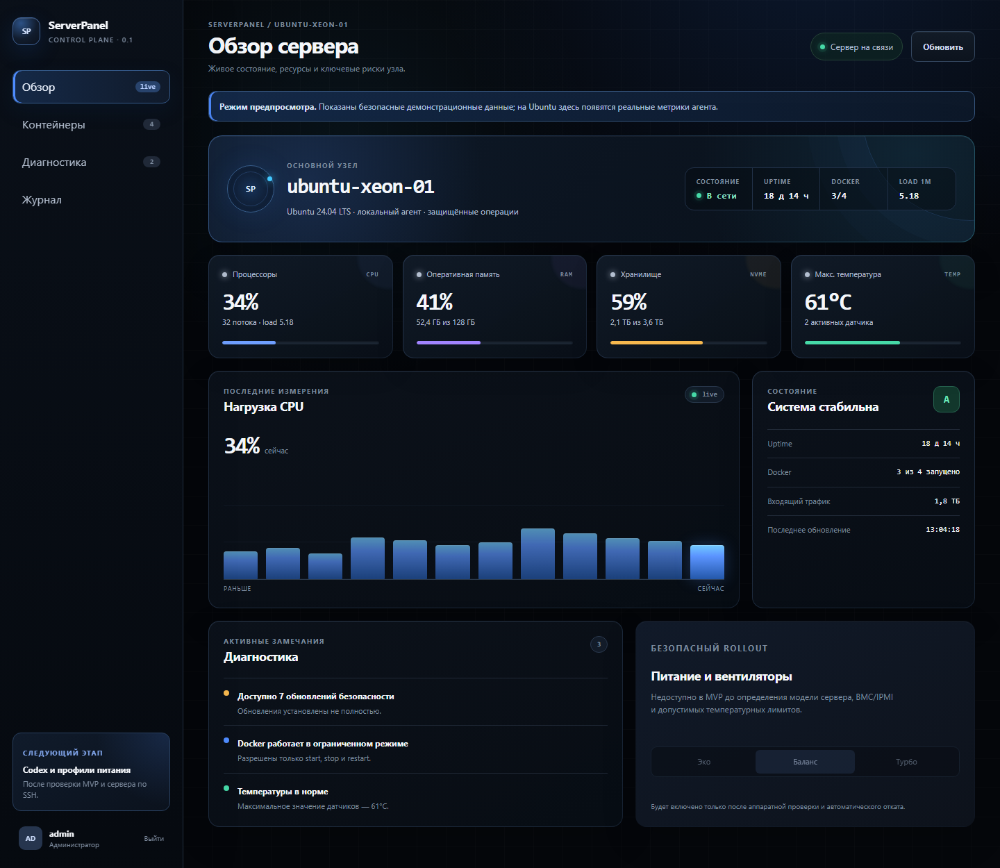
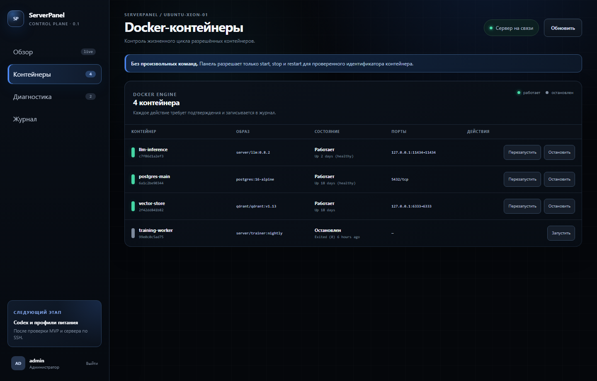
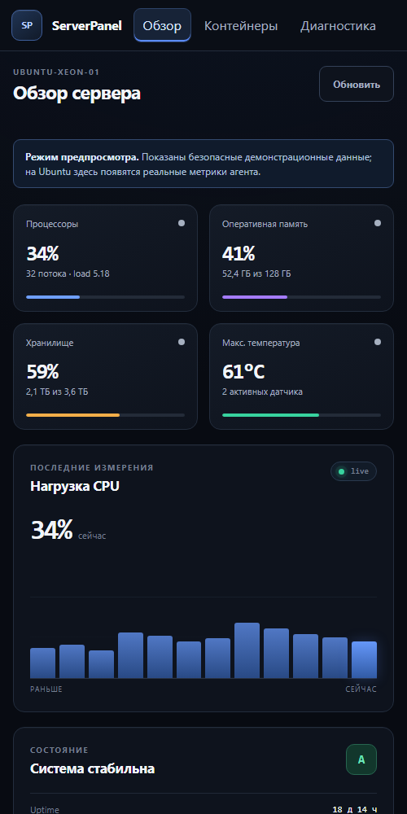

# ServerPanel

Publicly developed, self-hosted control panel for Ubuntu 24.04 and 26.04 LTS servers. ServerPanel is being built for operators who want clear health monitoring and carefully constrained server controls without living in a terminal.

> [!IMPORTANT]
> This repository is an early MVP. Keep it behind a VPN or an authenticated reverse proxy until the security checklist is complete. Never expose the agent, Docker socket, or Codex App Server directly to the internet.

## First milestone

- Responsive dark operations dashboard
- CPU, memory, disk, load and temperature telemetry
- Local username/password authentication created from Ubuntu
- Docker inventory with opt-in start, stop and restart actions
- Health findings, audit history and recovery guidance
- Power profiles shown as hardware-dependent capabilities
- Codex integration boundary designed around localhost/Unix sockets and approvals
- One-command Ubuntu installer with verified release checksums

## Architecture

```text
Browser -> Tailscale HTTPS / reverse proxy -> local agent (loopback only)
                                             +-> static web interface
                                      +-> /proc and /sys telemetry
                                      +-> allowlisted Docker actions
                                      +-> audit log
                                      +-> Codex App Server bridge (future)
```

The browser never receives host credentials and never talks to Docker or Codex directly. The local agent does not expose a general shell endpoint.

Read [ARCHITECTURE.md](docs/ARCHITECTURE.md), [SECURITY.md](SECURITY.md), and [ROADMAP.md](ROADMAP.md) before deploying or contributing.

## Development

Requirements: Node.js 22+ and Go 1.22+.

```bash
npm ci
npm run dev
```

The current web preview uses realistic demo telemetry. The Ubuntu agent is developed in `agent/` and will replace demo data when connected.

## Interface preview

### Server overview



### Docker containers



### Mobile layout



## Installation

The intended release flow is:

```bash
curl -fsSL https://raw.githubusercontent.com/Massnaev/serverpanel/main/install.sh | sudo bash
```

The installer verifies the published SHA-256 release checksum, binds the agent to loopback, creates the first administrator, and prints a one-time password. Do not use an installer copied from an issue or chat message. Release archives are produced on Ubuntu with `scripts/build-release.sh`; each archive contains the tested Linux agent and prebuilt static interface. Node.js is not installed or run on the managed server.

## Secrets

- Commit `.env.example`, never `.env`.
- Store runtime secrets in root-readable files or the OS credential store.
- Never commit API keys, OAuth tokens, `~/.codex/auth.json`, private certificates, generated passwords, or production logs.
- Treat Docker access and Codex credentials as root-equivalent capabilities.

## Contributing

Each logical change should be committed separately. Security-sensitive changes need tests and an explanation of the capability they add or widen.

## Donations

If ServerPanel is useful to you, you can support its development:

- **USDT (TRC-20):** `TUz11JVX41hTXBUWbbRazmBRWhxBGkytqT`

Always verify the network and address before sending funds. Cryptocurrency transfers cannot be reversed.

## License

A license will be selected before the first public release.
